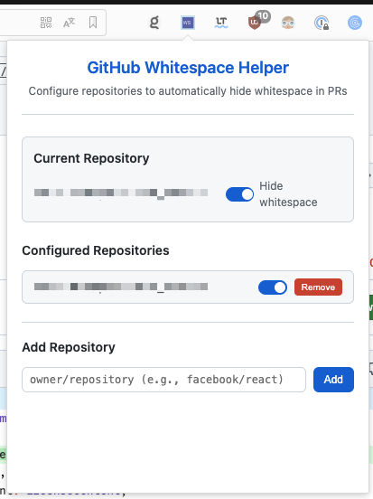

# GitHub Whitespace Helper

A Chrome extension that automatically enables hiding whitespaces in GitHub PRs for configurable repositories.

**Disclaimer**: This extension is not affiliated with, endorsed by, or officially supported by GitHub, Inc. It is an independently developed third-party Chrome extension.

## Installation

### Option 1: CRX File (Recommended)
1. Download the `.crx` file
2. Drag and drop it into your Chrome extensions page (`chrome://extensions/`)
3. Click "Add extension" when prompted

### Option 2: Manual Installation
1. Download and extract the ZIP file
2. Open Chrome and go to `chrome://extensions/`
3. Enable "Developer mode" (top right toggle)
4. Click "Load unpacked"
5. Select the extracted `github-whitespace-helper` folder

### For Developers: Creating the CRX File
1. Go to `chrome://extensions/`
2. Enable "Developer mode"
3. Click "Pack extension"
4. Select the `github-whitespace-helper` folder
5. Chrome generates:
   - `github-whitespace-helper.crx` (installable file)
   - `github-whitespace-helper.pem` (private key - save this!)

**Important**: Save the `.pem` file - you'll need it to update the extension later. Don't share the `.pem` file as it's your private signing key.

## Usage

1. Navigate to any GitHub PR page
2. Click the extension icon in your browser toolbar
3. Toggle repositories to automatically hide whitespace
4. Settings sync across your devices

## Features

- ✅ Automatically hides whitespace in configured repositories
- ✅ Configurable repository settings via popup UI
- ✅ Cross-device sync using Chrome storage
- ✅ Handles GitHub's SPA navigation
- ✅ Immediate refresh when toggling current repository
- ✅ Smart detection - only refreshes when viewing files tab

## Files

- `manifest.json` - Extension configuration
- `content.js` - Handles GitHub PR page interactions
- `popup.html/css/js` - User interface for configuration
- `background.js` - Storage management and initialization
- `icon*.png` - Extension icons

## Permissions

- `storage` - Save repository preferences
- `activeTab` - Access current tab information
- `*://github.com/*/pull/*` - Run on GitHub PR pages

## Support

For issues or feature requests, please create an issue in the repository.
